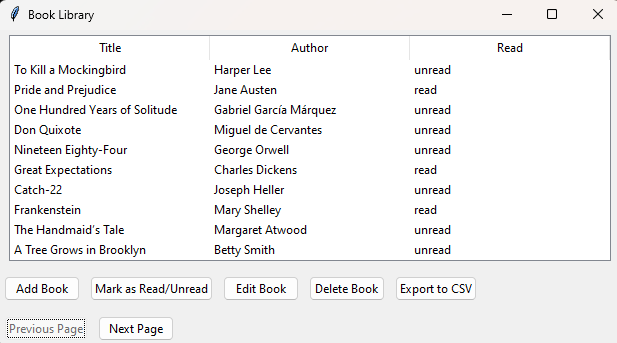

# Book Library App

A simple Python application for managing a book library using tkinter and SQLite.




## Table of Contents

- [Introduction](#introduction)
- [Features](#features)
- [Installation](#installation)
- [Usage](#usage)
- [Dependencies](#dependencies)
- [Contributing](#contributing)
- [License](#license)

## Introduction

The Book Library App is a basic desktop application written in Python using the tkinter library for the user interface and SQLite as the database backend. It allows users to manage a collection of books, mark them as read or unread, edit book details, and export the library to a CSV file.

## Features

- Add new books to the library
- Mark books as read or unread
- Edit book details
- Delete books from the library
- Export the library to a CSV file
- Pagination for better organization

## Installation

1. Clone the repository:

   ```bash
   git clone https://github.com/your-username/book-library-app.git
   ```

2. Navigate to the project directory:

   ```bash
   cd book-library-app
   ```

3. Install the required dependencies:

   ```bash
   pip install -r requirements.txt
   ```

## Usage

1. Run the application:

   ```bash
   python book_library_app.py
   ```

2. Use the provided buttons to perform various actions such as adding books, marking as read/unread, editing, and deleting.

3. Pagination buttons allow you to navigate through different pages of the book library.

## Dependencies

- `tkinter` (usually included with Python)
- `sqlite3`
- `csv`

## Contributing

Contributions are welcome! If you find any issues or have suggestions for improvements, feel free to open an issue or submit a pull request.
